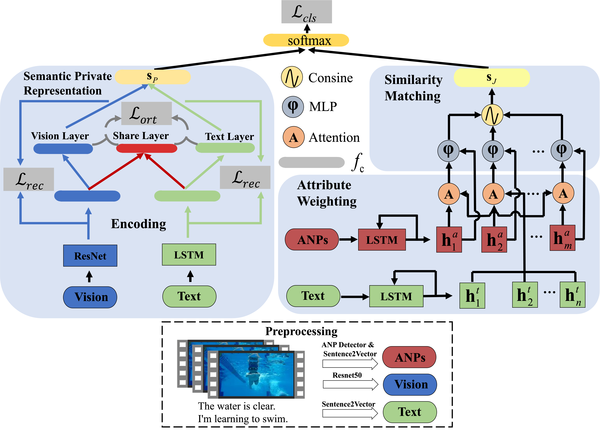
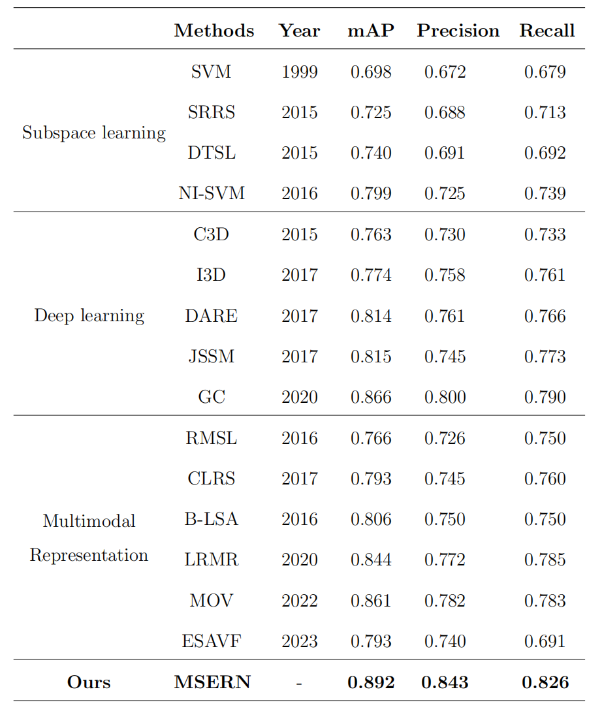

# Multimodal Semantic Enhanced Representation Network for Micro-video Event Detection

## abstract
Currently, micro-videos have gained widespread acceptance as a prominent form of user-generated content across various social media platforms. The accurate event analysis of micro-videos can greatly benefit the diverse applications of social media platforms.
Although some studies have shown promising results from a multimodal perspective, the challenge still remains in extracting informative cues from inaccurate modalities, particularly for the text modality that is prone to inaccuracies and noise.  In this paper, we propose a multimodal semantic enhanced representation network (MSERN) for micro-video event detection.
To better tackle inaccurate and noisy text sentences, we first extract visual concepts in the form of adjective-noun pairs (ANPs) to complement textual descriptions through a fine-grained common representation module.
To maximize the acquisition of modality-specific cues from both visual and textual modalities, we then implement a coarse-grained private representation module  to ensure that private representations encompass unique facets beyond the common perspective. Finally, considering the collaboration of two modules,  the fine-grained common  and coarse-grained private representations are integrated to ensure a reinforced micro-video representation.
We evaluate our proposed method on a micro-video event detection dataset and
experiment results show the superior performance compared with state-of-the-art methods.

## method


## results


## cite
```

```